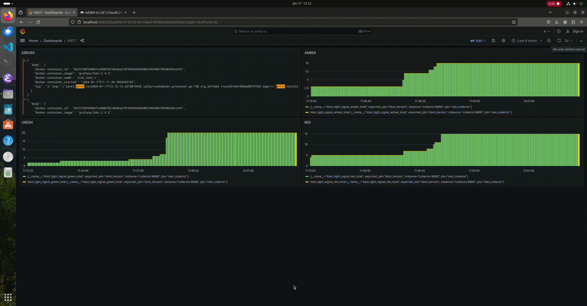

# Налаштування моніторингу для бота "kbot"
   
1. Додаємо конфігураційні файли для OpenTelemetry, Fluent-bit, Grafana, Loki, Prometheus та docker-compose маніфест:
```otel-collector-contrib.yaml
receivers:
  otlp:
    protocols:
      grpc:
      http:
        endpoint: "0.0.0.0:3030"

exporters:
  logging:
  loki:
    endpoint: http://loki:3100/loki/api/v1/push
  prometheus:
    endpoint: "0.0.0.0:8889"

service:
  pipelines:
    logs:
      receivers: [otlp]
      exporters: [loki]
    traces:
      receivers: [otlp]
      exporters: [logging]
    metrics:
      receivers: [otlp]
      exporters: [logging,prometheus]
```

```fluent-bit.conf
[SERVICE]
    flush 1
    log_level error

[INPUT]
    Name   tail
    Path   /var/lib/docker/containers/*/*.log
    Parser docker
    Refresh_Interval 30
    Ignore_Older 6h
    Docker_Mode  On
    Tag source.docker.<container_id>
    Tag_Regex (.*\/(?<container_id>.*)-json\.log)

[FILTER]
    Name   lua
    Match  source.docker.*
    script /fluent-bit/bin/docker-metadata.lua
    call   encrich_with_docker_metadata

[OUTPUT]
    Name                 opentelemetry
    Match                source.docker.*
    Host                 collector
    Port                 3030
    metrics_uri          /v1/metrics
    logs_uri             /v1/logs
    traces_uri           /v1/traces
    Log_response_payload True
    tls                  off
    tls.verify           off
    # add user-defined labels
    add_label            app fluent-bit
    add_label            color blue
```

```docker-metadata.lua
DOCKER_VAR_DIR = '/var/lib/docker/containers/'
DOCKER_CONTAINER_CONFIG_FILE = '/config.v2.json'
DOCKER_CONTAINER_METADATA = {
  ['docker.container_name'] = '\"Name\":\"/?(.-)\"',
  ['docker.container_image'] = '\"Image\":\"/?(.-)\"',
  ['docker.container_started'] = '\"StartedAt\":\"/?(.-)\"'
}

cache = {}

-- Gets metadata from config.v2.json file for container
function get_container_metadata_from_disk(container_id)
  local docker_config_file = DOCKER_VAR_DIR .. container_id .. DOCKER_CONTAINER_CONFIG_FILE
  fl = io.open(docker_config_file, 'r')

  if fl == nil then
    return nil
  end

  -- Parse json file and create record for cache
  local data = {}
  for line in fl:lines() do
    for key, regex in pairs(DOCKER_CONTAINER_METADATA) do
      local match = line:match(regex)
      if match then
        data[key] = match
      end
    end
  end
  fl:close()

  if next(data) == nil then
    return nil
  else
    return data
  end
end

function encrich_with_docker_metadata(tag, timestamp, record)
  -- Get container id from tag
  container_id = tag:match'.*%.(.*)'
  if not container_id then
    return 0, 0, 0
  end

  -- Add container_id to record
  new_record = record
  new_record['docker.container_id'] = container_id

  -- Check if we have fresh cache record for container
  local cached_data = cache[container_id]
  if cached_data == nil then
    cached_data = get_container_metadata_from_disk(container_id)
  end

  -- Metadata found in cache or got from disk, enrich record
  if cached_data then
    for key, regex in pairs(DOCKER_CONTAINER_METADATA) do
      new_record[key] = cached_data[key]
    end
  end

  return 1, timestamp, new_record
end
```

```grafana-datasources.yaml
apiVersion: 1

datasources:
- name: Prometheus
  type: prometheus
  uid: prometheus
  orgId: 1
  url: http://prometheus:9090
  basicAuth: false
  isDefault: false
  version: 1
  editable: true
  jsonData:
    httpMethod: GET

- name: Loki
  type: loki
  access: proxy 
  orgId: 1
  url: http://loki:3100
  basicAuth: false
  isDefault: false
  version: 1
  editable: true
```

```loki-local-config.yaml
auth_enabled: false

server:
  http_listen_port: 3100
  grpc_listen_port: 9096

common:
  instance_addr: 127.0.0.1
  path_prefix: /tmp/loki
  storage:
    filesystem:
      chunks_directory: /tmp/loki/chunks
      rules_directory: /tmp/loki/rules
  replication_factor: 1
  ring:
    kvstore:
      store: inmemory

query_range:
  results_cache:
    cache:
      embedded_cache:
        enabled: true
        max_size_mb: 100

schema_config:
  configs:
    - from: 2020-10-24
      store: boltdb-shipper
      object_store: filesystem
      schema: v11
      index:
        prefix: index_
        period: 24h

ruler:
  alertmanager_url: http://localhost:9093

# By default, Loki will send anonymous, but uniquely-identifiable usage and configuration
# analytics to Grafana Labs. These statistics are sent to https://stats.grafana.org/
#
# Statistics help us better understand how Loki is used, and they show us performance
# levels for most users. This helps us prioritize features and documentation.
# For more information on what's sent, look at
# https://github.com/grafana/loki/blob/main/pkg/usagestats/stats.go
# Refer to the buildReport method to see what goes into a report.
#
# If you would like to disable reporting, uncomment the following lines:
analytics:
  reporting_enabled: false
```

```prometheus.yaml
global:
  scrape_interval: 15s 
  evaluation_interval: 15s

scrape_configs:
  - job_name: otel_collector
    scrape_interval: 5s
    static_configs:
      - targets: ['collector:8889']

  - job_name: 'prometheus'
    static_configs:
      - targets: [ 'localhost:9090' ]
```

```docker-compose.yaml
version: "3"
services:

  # Kbot
  kbot:
    image: devdp/kbot:v1.0.6-otel-linux-amd64
    environment:
      - METRICS_HOST=collector:4317
      - TELE_TOKEN=${TELE_TOKEN}

  # OTEL contrib collector for Loki
  collector:
    image: otel/opentelemetry-collector-contrib:0.92.0
    command: [--config=/etc/otel-collector-config.yaml]
    volumes:
      - ./collector/otel-collector-contrib.yaml:/etc/otel-collector-config.yaml 
    ports:
      - 4317:4317

  # Prom
  prometheus:
    image: prom/prometheus:latest
    command:
      - --config.file=/etc/prometheus.yaml
      - --web.enable-remote-write-receiver
      - --enable-feature=exemplar-storage
    volumes:
      - ./prometheus/prometheus.yaml:/etc/prometheus.yaml
    ports:
      - "9090:9090"
  
  # FluentBit
  fluentbit:
    image: fluent/fluent-bit:latest
    volumes:
      - ./fluent-bit/docker-metadata.lua:/fluent-bit/bin/docker-metadata.lua
      - ./fluent-bit/fluent-bit.conf:/fluent-bit/etc/fluent-bit.conf
      - /var:/var
      - /proc:/host/proc
      - /sys:/host/sys
    ports:
      - "3001:3001"

  # Loki
  loki:
    image: grafana/loki:2.9.3
    command: 
      - -config.file=/etc/loki/local-config.yaml
      - -log.level=error
    volumes:
      - ./loki/loki-local-config.yaml:/etc/loki/local-config.yaml
    ports:
      - "3100:3100"
  
  # Grafana
  grafana:
    image: grafana/grafana:10.2.3
    volumes:
      - ./grafana/grafana-datasources.yaml:/etc/grafana/provisioning/datasources/datasources.yaml
    environment:
      - GF_AUTH_ANONYMOUS_ENABLED=true
      - GF_AUTH_ANONYMOUS_ORG_ROLE=Admin
      - GF_AUTH_DISABLE_LOGIN_FORM=true
      - GF_FEATURE_TOGGLES_ENABLE=traceqlEditor
      - GF_SERVER_HTTP_PORT=3002
    ports:
      - "3002:3002"
```

2. Додаємо токен для доступу до Telegram API:
```
read -s TELE_TOKEN
export TELE_TOKEN=$TELE_TOKEN
```
3. Запускаємо весь стек моніторингу за допомогою Docker-compose:
```
docker compose -f otel/docker-compose.yaml up
```
4. Налаштовуємо Dashboard в Grafana, доступ на порті 3002. Якщо запуск локально, то: `localhost:3002`
5. Взаємодіємо з ботом для перевірки надходження метрики та логів:
	/start – для отримання інструкцій
	/s red | amber | green - команди для взаємодії.
6. Після взаємодій передивляємось дашборд:

